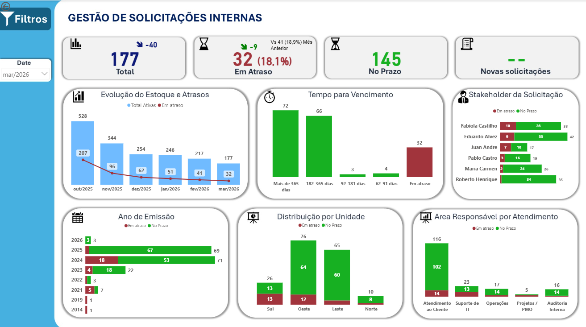

# Dashboard de Gestão de Solicitações Internas

## Objetivo
Desenvolver um dashboard para monitoramento de solicitações internas, com foco em SLA, identificação de gargalos e análise de performance operacional.

## Principais Insights
- Taxa de cumprimento de SLA
- Identificação de área com maior atraso
- Distribuição de solicitações por prioridade
- Evolução do backlog ao longo do tempo

## Ferramentas
- Power BI
- Excel (dados simulados)
- DAX

## Visual do Dashboard

## Observação
Os dados utilizados neste projeto são fictícios, simulando um ambiente corporativo real.

## Autor
Marcos Oliveira Silva
